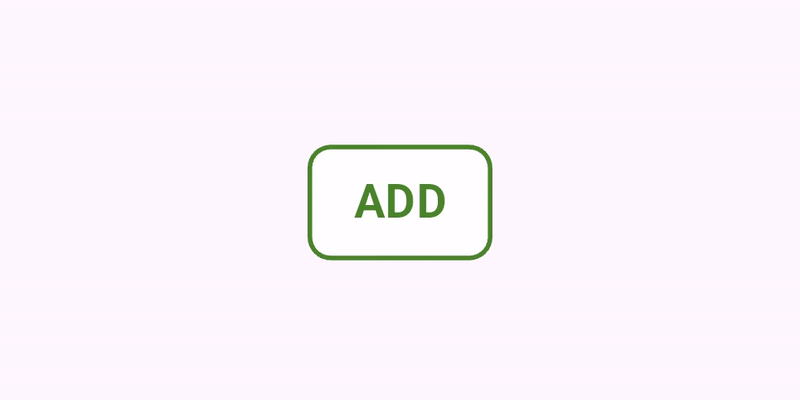
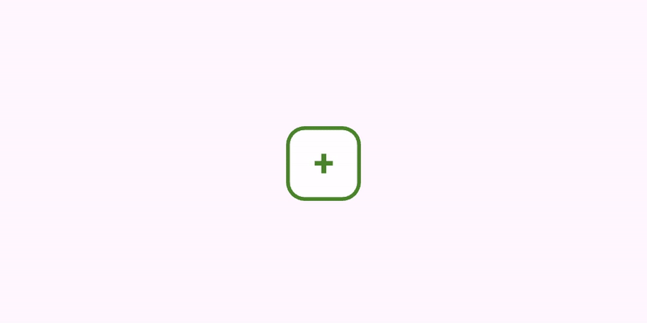
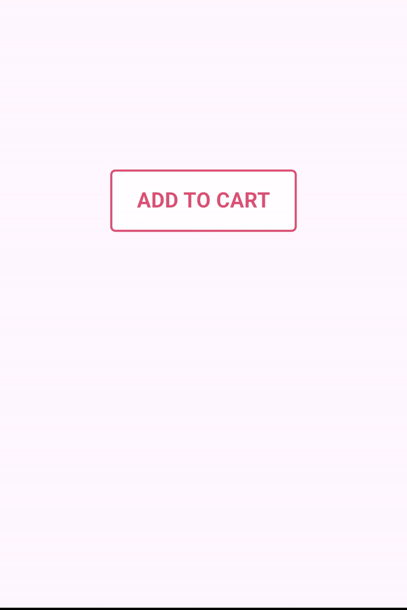

# add_to_cart_animation_button

Add to Cart Button with Animation and Custom Styling for Modern Shopping apps like experience.

See the [install instructions](https://www.google.com).

## References

Here is a cheatsheet of parameters available for customization 

- **`value`**: *(int)*  
  The current value of the counter.

- **`onIncrement`**: *(Function(int))*  
  Callback triggered when the increment button is pressed. The updated value is passed as a parameter.
  - If the maximum value (`maxValue`) is reached, the callback is triggered but returns the same value without incrementing.

- **`onDecrement`**: *(Function(int))*  
  Callback triggered when the decrement button is pressed. The updated value is passed as a parameter.

- **`initialText`**: *(Text?)*  
  Text displayed in the initial state.

- **`counterTextStyle`**: *(TextStyle?)*  
  Style for the counter text.

- **`duration`**: *(Duration?)*  
  Duration for the animations.

- **`initialBoxDecoration`**: *(BoxDecoration?)*  
  Box decoration for the initial state.

- **`counterBoxDecoration`**: *(BoxDecoration?)*  
  Box decoration for the counter state.

- **`incrementIcon`**: *(Icon?)*  
  Icon for the increment button.

- **`decrementIcon`**: *(Icon?)*  
  Icon for the decrement button.

- **`height`**: *(double)*  
  Height of the widget.

- **`width`**: *(double)*  
  Width of the widget.

- **`heightScaleFactor`**: *(double)*  
  Scale factor for height during the counter state.

- **`widthScaleFactor`**: *(double)*  
  Scale factor for width during the counter state.

- **`minValue`**: *(int)*  
  Minimum value allowed for the counter.

- **`maxValue`**: *(int)*  
  Maximum value allowed for the counter.

## Possibilities

### Basic Button:

The most basic button will increment and decrement the count by 1 with an animation after you
override the required functions. When count is 0, a standard 'ADD' Text is used as a placeholder.

```dart
// Default value of cart item
int value = 0;

@override
Widget build(BuildContext context) {
  return AddToCart(
    value: value,
    onIncrement: (newValue) {
      value = newValue;
      setState(() {});
    },
    onDecrement: (newValue) {
      value = newValue;
      setState(() {});
    },
    maxValue: 8,
  );
}
```


### Expanding Button:

Moving on to where real animation shows up, you can animate the change in button size and it's
style when an item is added. Just provide the widget with both before and after BoxDecorations and watch the magic happen.

Use the `widthScaleFactor` and `heightScaleFactor` parameter to scale size of button after item is added.

```dart
int value = 0;

@override
Widget build(BuildContext context) {
  return AddToCart(
    value: value,
    onIncrement: (newValue) {
      // New Increased Value
      value = newValue;
      setState(() {});
    },
    onDecrement: (newValue) {
      // New Decreased Value
      value = newValue;
      setState(() {});
    },
    width: 80,
    widthScaleFactor: 1.7,
    duration: Duration(milliseconds: 100),
    initialBoxDecoration: BoxDecoration(
      color: Colors.white,
      borderRadius: BorderRadius.circular(10),
      border: Border.all(
        color: Color.fromRGBO(74, 132, 44, 1),
        width: 2,
      ),
    ),
    initialText: Text(
      'ADD',
      style: TextStyle(
        color: Color.fromRGBO(74, 132, 44, 1),
        fontWeight: FontWeight.bold,
        fontSize: 20,
      ),
    ),
    maxValue: 8,
  );
}
```




### Plus Button:

Change the default 'ADD' Text to any other widget, like in this example where a Plus Button is used as a placeholder which later expands into a counter widget.

Setting the initial `height` and `width` of the button to form a square.

```dart
int value = 0;

@override
Widget build(BuildContext context) {
  return AddToCart(
    value: value,
    onIncrement: (newValue) {
      // New Increased Value
      value = newValue;
      setState(() {});
    },
    onDecrement: (newValue) {
      // New Decreased Value
      value = newValue;
      setState(() {});
    },
    width: 40,
    height: 40,
    heightScaleFactor: 1.2,
    widthScaleFactor: 3.4,
    duration: Duration(milliseconds: 100),
    initialBoxDecoration: BoxDecoration(
      color: Colors.white,
      borderRadius: BorderRadius.circular(10),
      border: Border.all(
        color: Color.fromRGBO(74, 132, 44, 1),
        width: 2,
      ),
    ),
    initialText: Text(
      '+',
      style: TextStyle(
        color: Color.fromRGBO(74, 132, 44, 1),
        fontWeight: FontWeight.bold,
        fontSize: 20,
      ),
    ),
    maxValue: 8,
  );
}
```




### Custom Styling

Experiment with colors, styles, and decorations to bring your animations to life and making Add to Cart action for a user fun.

Add custom SnackBar handling on `onIncrement` function and many more!

Code for this can be found in the [example](https://github.com/adiptdevtomar/add_to_cart_animated_button/tree/master/example) project




## Bugs or Requests
If you encounter any problems feel free to open an issue. If you feel the library is missing a feature, please raise a ticket on GitHub and i'll look into it.

